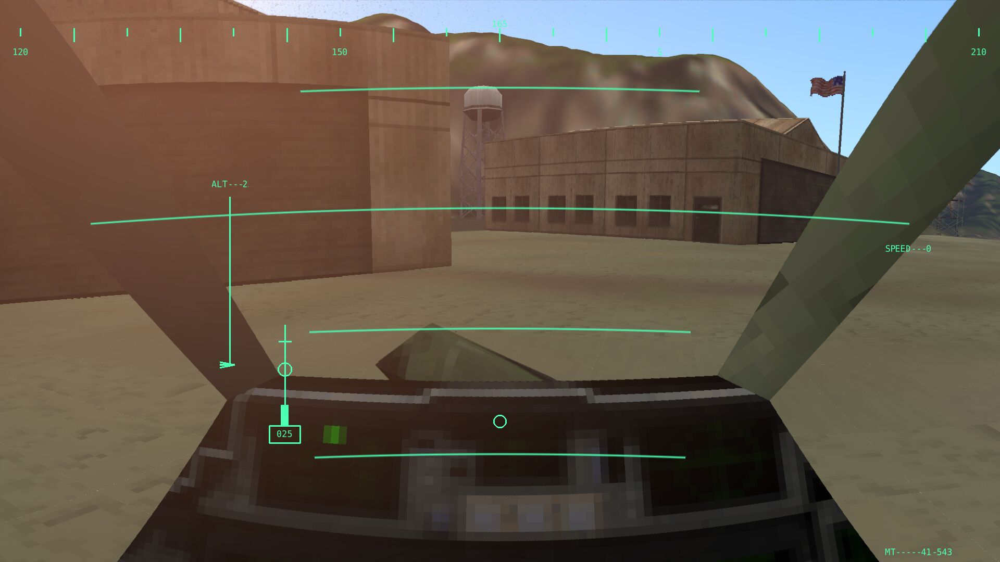
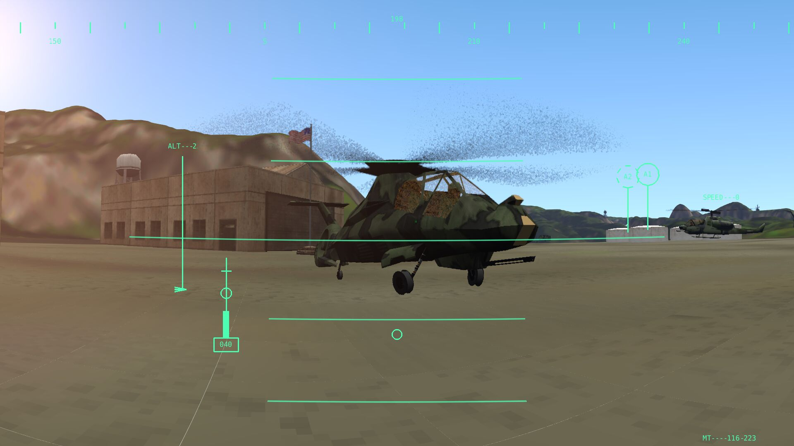

# sioux is not comanche

sioux is a drop-in replacement engine for the 1997 game *comanche 3*, similar
to how gzdoom is an engine for the 1993 game doom (only that gzdoom is complete
and working).




back then i loved the game and was blown away by the voxel engine
and the cohesive mood introduced into the graphics by the use of
palettes.

playing it today i still think it's a great game. but.

* a flight simulator with a camera projection that does not allow to pitch and
  bank without weird distortions? luckily today's GPUs are insanely powerful and
  i replaced the terrain rendering by more or less honest ray tracing.

* faking similar colour mood by multiplying a consistent palette is nice.
  today this job is usually done by global illumination.

# compile

the build system is a simple makefile with some pkg-config and hardcoded paths:

```
$ make
```


# run

you'll need the original game cd, in particular the resource.res file (i know,
the gold edition has a pff instead but my old cdrom didn't yet).

TODO: describe how to extract the res with the tools in ```tools/``` as
well as the external tool ```pup/``` by vladimir stupin.

```
$ ./sx
```

For SDL2_mixer to work with fluidsynth you need to set SDL_SOUNDFONTS:

```
$ export SDL_SOUNDFONTS=<path to soundfonts directory>/<soundfont filename>
```

# known issues

this is just release-early-release-often code for your perusal. it's totally
not playable. in particular:

* i implemented some of the trigger-based scripting system but it's by no means complete

* no enemy ai, like, at all

* loaded the scene and all objects and their textures, but pretty much none of
them are animated or even correctly located at ground level

* did not implement weapons

* the helicopter uses some very simplistic flight dynamics model which comes
close to the behaviour of the original. that said even the
original is pretty arcade.

* midi file playing doesn't reflect gamestate condition yet

# TODO items

* shading (currently it's just pretty much displaying the texture colour and normal)

* global illumination, or some close fake

* cloud rendering (i don't mean billboards, i mean ray marched clouds like in the nubis cloud rendering system)

* simulate weather and winds in the terrain (maybe i'll settle for incompressible fluids here)

* borrow more sophisticated flight dynamics from flightgear (let's make this game a little harder..)

* take local winds/turbulence into account when simulating flight dynamics

* port rendering to vulkan so we can use RTX


